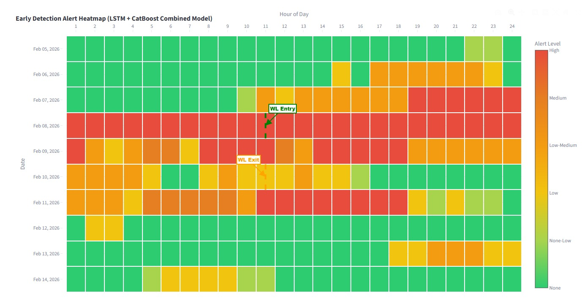
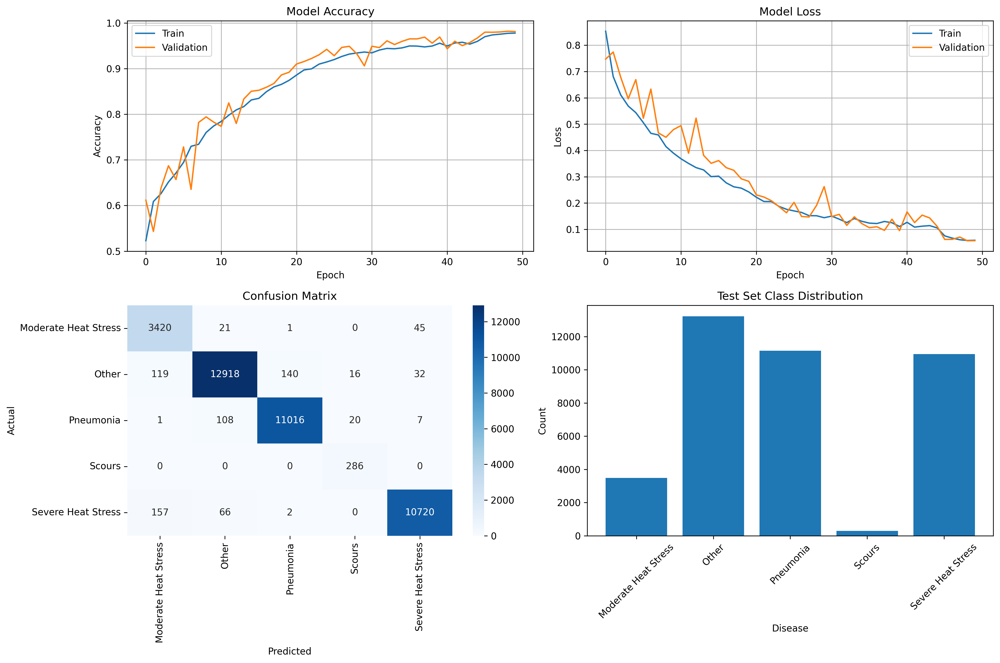
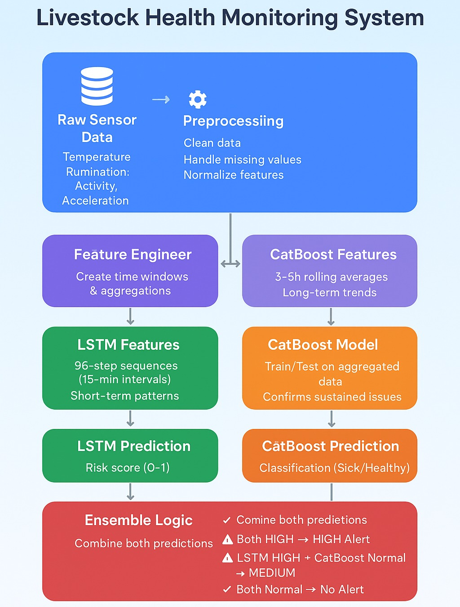

# 🐄 Livestock Sickness Prediction System

<div align="center">

**An intelligent system leveraging machine learning to predict livestock sickness for improved animal welfare and farm management.**

</div>

## 📖 Overview

The Livestock Sickness Prediction System is a data science and machine learning project designed to help farmers and agricultural professionals proactively identify potential health issues in their livestock. By processing relevant data, the system trains predictive models that can forecast the onset of sickness, enabling timely intervention, reducing economic losses, and promoting better animal welfare. This repository contains the complete pipeline from data pre-processing to model training and a dashboard for visualization of insights and predictions.

## ✨ Features

-   🎯 **Data Pre-processing**: Robust handling and cleaning of raw livestock health data.
-   🧪 **Feature Engineering**: Extraction and creation of relevant features for improved model performance.
-   🧠 **Machine Learning Model Training**: Development and training of predictive models to identify sickness patterns.
-   📈 **Sickness Prediction**: Ability to generate predictions on new, unseen livestock data.
-   📊 **Performance Evaluation**: Metrics and visualizations to assess model accuracy and reliability.
-   🖥️ **Interactive Dashboard**: A dedicated section for visualizing data, model outputs, and actionable insights.

## 🖥️ Screenshots

### Dashboard Overview


### Heatmap Distribution

*Detailed heatmap showcasing data distribution patterns across various health metrics.*

### Disease Classification Results


### Model Architecture


## 🛠️ Tech Stack

**Core ML & Data Processing:**
- Python
- Jupyter Notebook
- Pandas
- NumPy
- Scikit-learn
- Matplotlib
- Seaborn
- CatBoost & LSTM

**Dashboard/Visualization:**
- Streamlit

## 📁 Project Structure

```text
Livestock-Sickness-Prediction-System/
├── .gitignore          # Specifies intentionally untracked files to ignore
├── Dashboard/          # Contains code and assets for the interactive dashboard
├── Outputs/            # Stores generated reports, plots, processed data, and prediction results
├── Pre-Processing/     # Jupyter notebooks or scripts for data cleaning, transformation, and feature engineering
├── README.md           # The main project README file
└── model/              # Jupyter notebooks or scripts for model training, evaluation, and saved model artifacts
    └── model artifacts/
        ├── CatBoost/   
        └── LSTM/       
```

## ⚙️ Configuration

This project primarily uses configuration defined within the Jupyter notebooks and Python scripts themselves.
-   **Data Paths**: Input and output data paths are typically configured at the beginning of relevant notebooks.
-   **Model Parameters**: Hyperparameters and model-specific settings are set directly in the model training scripts.

For a production deployment, it is advisable to externalize these configurations into dedicated files (e.g., `.env`, `config.ini`, or `YAML`) for easier management.

## 🔧 Development

### Running Jupyter Notebooks
To work on the data processing and model development:
```bash
# From the project root
jupyter notebook
```
Then navigate to the `Pre-Processing` or `model` directories within the Jupyter interface to open and run the notebooks.

### Development Workflow
1.  **Data Acquisition**: Ensure your raw livestock data is available (not included in this repository due to potential privacy/size).
2.  **Pre-processing**: Iterate on notebooks in `Pre-Processing/` to clean and transform data.
3.  **Model Building**: Develop and train models in `model/`. Experiment with different algorithms and parameters.
4.  **Evaluation**: Use notebooks to evaluate model performance and identify areas for improvement.
5.  **Dashboard Development**: If enhancing the dashboard, work within the `Dashboard/` directory and test locally.

## 🧪 Testing

Testing in a data science project often involves:
-   **Data Validation**: Checking data quality and consistency during pre-processing.
-   **Model Performance Evaluation**: Using metrics like accuracy, precision, recall, F1-score, AUC, etc., on validation and test sets.
-   **Unit Tests for Utility Functions**: Standard Python `unittest` or `pytest` could be used.

## 🚀 Deployment

The project can be deployed by running the individual components:
-   The pre-processing and model training stages are typically executed as batch jobs or on-demand using Jupyter/Python scripts.
-   The dashboard can be deployed as a web application on cloud platforms (e.g., AWS, GCP, Azure, Heroku, Vercel) or on a local server.

---

<div align="center">

**⭐ Star this repo if you find it helpful!**

Made with ❤️ by [RasheshDesai](https://github.com/RasheshDesai)

</div>
